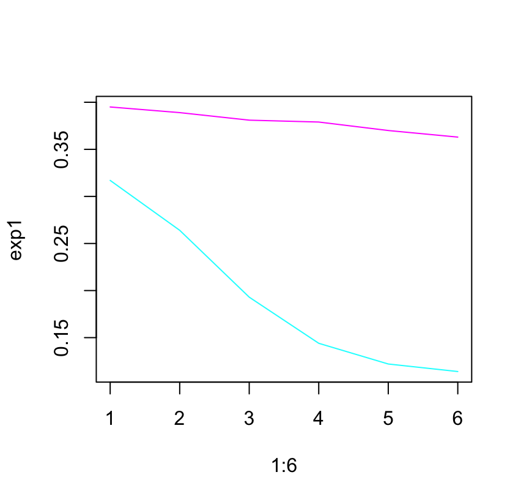

## Лабораторная работа "Определение активности каталазы, влияние ингибиторов на активность фермента" ##
*Цель:* Определение изменения скорости исчезновения пероксида водорода в присутствии азида натрия.<br>
*Принцип метода:*
Каталаза, «зеленый белок», состоит из четырех идентичных субъединиц (Mm 60 000), каждая из которых содержит гем в высокоспиновом состоянии с ионом железа (Ш) в центре. Четырьмя координационными связями железо связано с порфироновым кольцом, натрия связь направлена на остаток тирозина в белке, а шестое положение остается свободным и может быть занято пероксидом или такими анионами, как цианид или фторид, которые блокируют активности фермента. <br>
*Ход определения*
В кварцевую кювету вносят 2.94 мл 0,018 М Н.О, и измеряют оптическую плотность при 240 им против 0.05 М фосфата калия. рН 7.0, величина поглощения относительно фосфат калия, должна быть 0.50+-0.01 при 240 нм. Если это не так, то доводят поглощение де этой величины с помощью 0.05 М фосфата калия или Н,03. Гол = 40 10* 1/М см. Затем добавляют в кювету 0,06 мл раствора каталазы и измеряют оптическую потность при 240 им далее измеряют оптическую плотность с интервалом 1 минуту. Изменение поглощения на 0,04/мин соответствует разложению 1 мкмоль Н202 в минуту. -1 МЕ. -1667 нкат. Строят график снижения А во времени.
Определим МЕ по формуле: МЕ(мкмоль/мин) = delta(А)/0.04
```r
exp1 = c(0.317, 0.264, 0.193, 0.144, 0.122, 0.114)
exp2_ing = c(0.395, 0.389, 0.381, 0.379, 0.370, 0.363)

deltA_exp1 = max(exp1) - min(exp1)
ME = deltA_exp1/0.04
```
МЕ = 5.075
В квардевую кювету вносят 2.84 мл 0.018 М НО, с оптической плотностью 0,50:0,01 при 240 нм. С, 1 мл раствора азида натрия и 0.06 мл раствора каталазы. Измеряют оптическую плотность при 240 вм с интервалом 1 минуту. Строят график и делают заключение о изменении скорости исчезновения пероксида водорода в присутствии азила натрия.
Построим график:
```r
plot(1:6, exp1, type="l", col="cyan", ylim = c(0.114, 0.395))
lines(1:6, exp2_ing, col="magenta")
print(min(exp2_ing)/min(exp1))
```
 <br>
*Вывод:* скорость исчезновения пероксида водорода в присутствии азида натрия уменьшилась в 3.184211 раза
