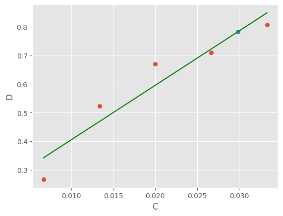

*Цель:* Определение концентрации белка в сыворотке крови лошади <br>
*Принцип метода:*
Метод основан на связывании красителя Кумаси с белками. Связанная форма имеет голубую окраску с максимумом поглощения при 595 нм. Таким образом, увеличение абсорбции раствора при длине волны 595 нм, пропорционально количеству белка в растворе. <br>
*Ход определения*
1,5 мл раствора, содержащего от 10 до 50 мкг белка, смешивают с 1,5 мл раствора красителя. Через 5 мин. измеряют оптическую плотность при 595 нм используя в качестве контроля пробу, не содержащую белка.
<table>
  <tr>
    <th>Номер п/п</th>
    <th>Содержание белка мкг</th>
    <th>Объем р-ра белка мл</th>
    <th>Вода мл</th>
    <th>Реактив Кумаси мл</th>
    <th>Показания СФ-а</th>
  </tr>
  <tr>
    <td>контроль</td>
    <td>-</td>
    <td>-</td>
    <td>1,5</td>
    <td>1,5</td>
    <td>0</td>
  </tr>
  <tr>
    <td>1</td>
    <td>10</td>
    <td>0,2</td>
    <td>1,3</td>
    <td>1,5</td>
    <td>0.267</td>
  </tr>
    <tr>
    <td>2</td>
    <td>20</td>
    <td>0,4</td>
    <td>1,1</td>
    <td>1,5</td>
    <td>0.523</td>
  </tr>
    <tr>
    <td>3</td>
    <td>30</td>
    <td>0,6</td>
    <td>0,9</td>
    <td>1,5</td>
    <td>0.670</td>
  </tr>
    <tr>
    <td>4</td>
    <td>40</td>
    <td>0,8</td>
    <td>0,7</td>
    <td>1,5</td>
    <td>0.709</td>
  </tr>
    <tr>
    <td>5</td>
    <td>50</td>
    <td>0,8</td>
    <td>0,7</td>
    <td>1,5</td>
    <td>0.806</td>
  </tr>
    <tr>
    <td>опыт</td>
    <td>10</td>
    <td>0.04</td>
    <td>1.45</td>
    <td>1,5</td>
    <td>0.782</td>
  </tr>
</table>
На основе проведенных опытов можем посчитать концентрацию белка в растворе. Для этого сначала пересчитаем концентрации:
```python
from matplotlib import pyplot as plt
from matplotlib import style   
import numpy as np
style.use('ggplot')

d = [0.267, 0.523, 0.670, 0.709, 0.806]
d_o = 0.782
c = [10/1500, 20/1500, 30/1500, 40/1500, 50/1500]```

Далее аппроксимируем данные и найдем точку для опыта:
```python
p = np.polyfit(c, d, 1)
yp = np.polyval(p, c)

xp_o = (d_o - p[1])/p[0]
```
Построим график:
```python
plt.scatter(c, d)
plt.scatter(xp_o, d_o)
plt.plot(c, yp, 'r', label='Approx', color="g")

plt.ylabel('D')
plt.xlabel('C')

plt.show()
str(round(xp_o/10*20000, 3)) + " мг/мл"
```

59.726 мг/мл
**Вывод**: концентрация белка в растворе составляет 59.726 мг/мл
